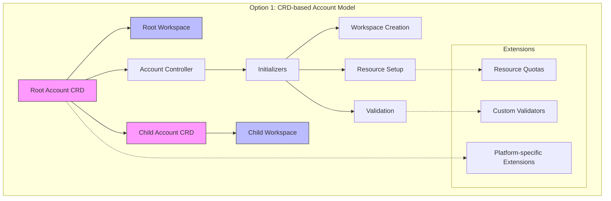
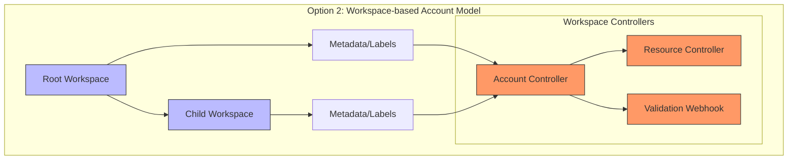
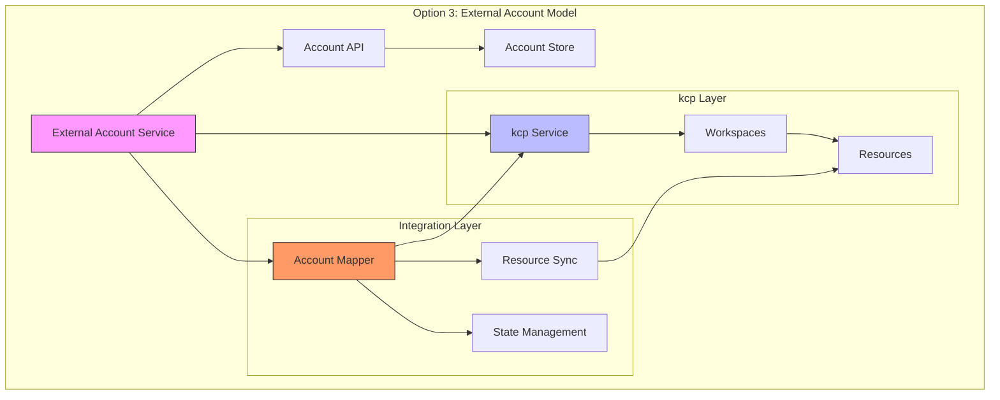

# ADR: Account Model Implementation in Platform Mesh using kcp

## Status: Proposed

## Deciders:
- Mirza Kopic (I073426)
- Bastian Ecterhoelter (I347365)

## Date: TBD

## Technical Story:
Evaluate implementation options for the account model in Platform Mesh using kcp to create a flexible, scalable, and interoperable system for managing accounts, services and workload instances.

## Context and Problem Statement

We need to implement an account model for Platform Mesh using kcp. The account model should be simple, scalable, and not locked to regions. It should support service and workload management, distinguish between services and applications, and allow for the decoupling of orthogonal aspects such as quotas, service validation, and access control. The core question is how to implement this account model effectively using kcp's workspace concepts and the Kubernetes Resource Model (KRM).

The account model that operates is platform specific. The account model is mostly like a central piece in a star schema, with additional extensions/dimensions as needed by the platform which can be specific to each implementation of the platform mesh. These can be handled as extensions to the account model, but the core account model should be kept simple and not allowed to grow.

## Decision Drivers

1. Need for a simple and scalable account model
2. Requirement to support hierarchical account structures
3. Desire to leverage kcp's workspace capabilities efficiently
4. Need for clear distinction between services and workloads
5. Requirement for extensibility to accommodate various provider-specific needs
6. Desire for orthogonal aspects to be decoupled from the core account model
7. Requirement for consistent and atomic account creation
8. Need for predictable resource hierarchy and relationship management
9. Requirement for cross-account operations and visibility
10. Desire for audit capability and compliance support

## Considered Options

### Option 1: Custom Resource Definition (CRD) for Account Model

This option involves creating a new CRD in that can be used to define the account model from an external perspective but can be used in kcp, with accounts managed as custom resources.
This option implements accounts as CRDs with a strict 1:1 mapping to kcp workspaces, using initializers for atomic creation and setup.
The account CRD should be the minimum frame, not to grow. There need to be other ways to extend partner/customer specific account implementation for platform.
The account model itself is living outside kcp and can be managed external from it, but kcp needs to work with that model to achieve account models goals.

Pros:
- Native Kubernetes approach, easily integrable with kcp
- Allows for declarative management of accounts
- Can be extended using additional fields or annotations
- Facilitates versioning and API evolution
- Atomic account creation through initializer pattern
- Clear, predictable 1:1 relationship with workspaces
- Built-in validation and dependency management through initializers for creation and status, but validation for aspects on account through interfaces in kcp
- Supports hierarchical account structures
- Facilitates staged resource creation
- Clear status tracking through conditions
- Workspaces own the resources they try to manage, and the account is the owner of the workspace
- Facilitates workspace references through account to specific implementations of a platform (as opposed to direct workspace access)
- The root work is a workspace to allow multi-workspace resources (e.g. OIDC config)
- With the account we can hide workspace complexity from the user

Cons:
- Potential performance impact with a large number of custom resources
- More complex initialization flow
- Potential for stuck initializers requiring manual intervention, could depend on the quality of implementation
- Need for careful timeout and retry handling

Important Considerations:
- Cascading of accounts needs investigation regarding kcp sharding capabilities if account model is concept in kcp and makes use of kcp's sharding
- The kcp framework needs to support a mechanism by which an account model can be supported. This does not mean that the account model is part of the kcp framework, but that mechanisms exist to create account model
- At the moment it is 1:1 account to workspace for the MVP, unless otherwise specified by use cases
- Self-referencing tree structure allows creation of child accounts
- There needs to be a root account and a root workspace, the rest flows from there

### Option 2: kcp Workspace as the Core Account Representation

This option uses kcp workspaces as the primary representation of accounts, with additional metadata stored in workspace annotations or labels.

Pros:
- Leverages kcp's existing hierarchical workspace model
- Provides built-in isolation and access control mechanisms
- Allows for easy implementation of hierarchical structures
- Facilitates management of resources within account context
- Simpler approach and more kcp native

Cons:
- Limited flexibility in storing complex account data
- May require additional controllers to manage account-specific operations
- Could lead to overloading of workspace concepts
- More tight coupling between account and workspace and kcp to account
- More required to define context for externals outside kcp for an account model (might not be sufficient for all use cases, e.g. you need to build more work on top)
- Would need additional validation maybe via an additional webhook implementation

### Option 3: kcp as a Service with Encapsulated Account Model (external to kcp)

This option positions kcp as a service that can be consumed by other teams, with the account model built as a layer on top.

Pros:
- Clear separation of concerns between kcp and account management
- Flexibility to evolve account model independently
- Can leverage existing kcp features while maintaining abstraction
- Loose coupling

Cons:
- Additional complexity in managing service layer
- Requires dedicated team for service maintenance
- Potential performance overhead from additional abstraction layer

Note: Owner is account owner of workspace, the account model is completely outside, but this is not the case for the MVP. It separates concerns, but has many downsides.

## Decision Outcome (Proposed)

The proposal is to with option 1, and the poc for the MVP can then validate that decision and design for an account model implementation.

### Positive Consequences

- Guaranteed consistent account setup
- Clear initialization status tracking
- Built-in failure handling

2. Clear Relationships:
- One-to-one account-workspace mapping
- Explicit parent-child relationships
- Clear resource ownership
- decoupling of account from kcp core structure

3. Extensibility:
- Custom initializers for different providers within kcp
- Pluggable initialization steps
- Support for future requirements
- account model can be extended and defined as per need basis independent of kcp, but allows platform operators to customize to their own needs

4. Operational Benefits:
- Clear status tracking
- Built-in retry mechanisms
- Audit trail of account setup

### Negative Consequences

- More complex initialization flow
- Need for careful error handling
- Potential for initialization deadlocks

2. Operational Overhead:
- Need for initializer management
- Potential for stuck initializations
- More complex debugging

## Risk Mitigation

1. Initialization Risks:
- Implement timeout mechanisms for initializers
- Create clear initialization dependency graphs
- Monitor initialization progress
- Provide manual intervention capabilities

2. Resource Management:
- Implement comprehensive cleanup mechanisms
- Define clear resource ownership
- Track resource dependencies
- Provide rollback capabilities

3. Operational Risks:
- Create comprehensive monitoring strategy
- Define clear operational procedures
- Implement automated recovery where possible
- Provide clear debugging tools

## Action Items

1. Create detailed design document for account-workspace relationship
2. Define initialization workflow and dependencies
3. Design monitoring and debugging strategy
4. Create operational procedures documentation
5. Define recovery and rollback procedures
6. Create test plan for initialization scenarios
7. Design audit and compliance tracking mechanisms

## Related Documents

- kcp Workspace Documentation
- Platform Mesh Architecture Overview
- Service Provider Integration Guide

## Notes

This is a living document and should be updated as implementation progresses and new requirements or challenges are discovered.
