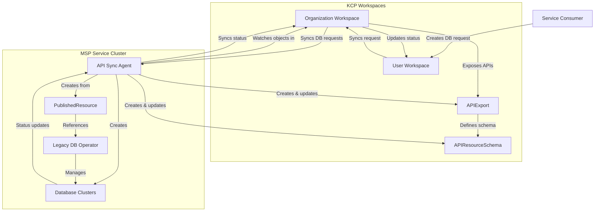
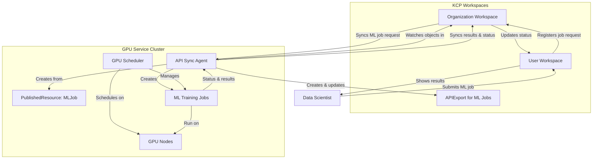
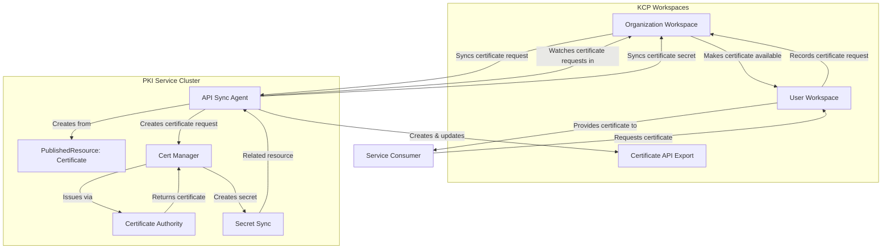
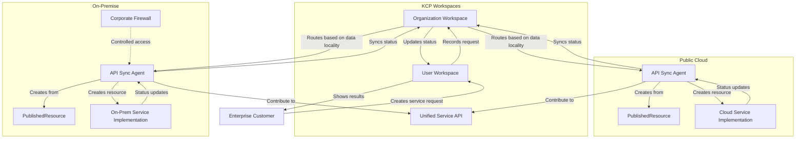
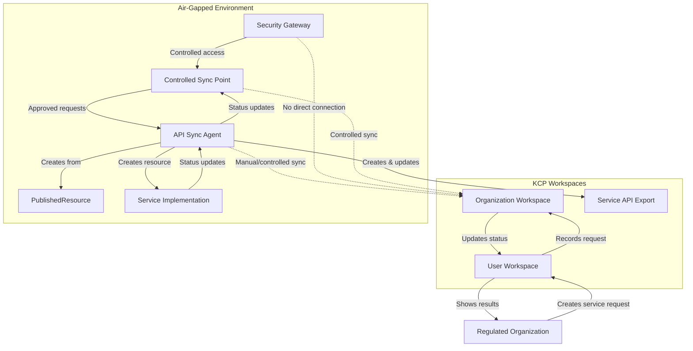
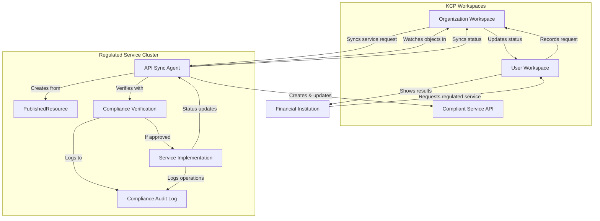
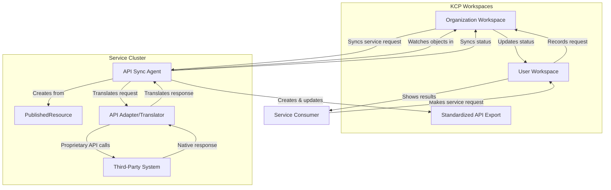
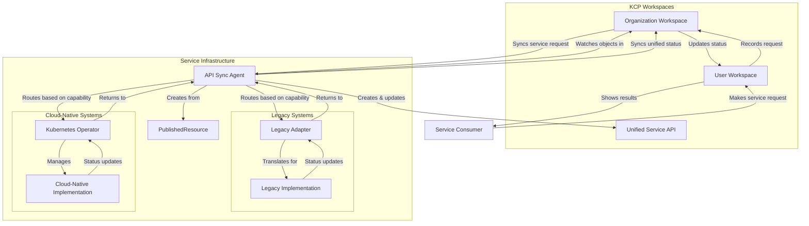
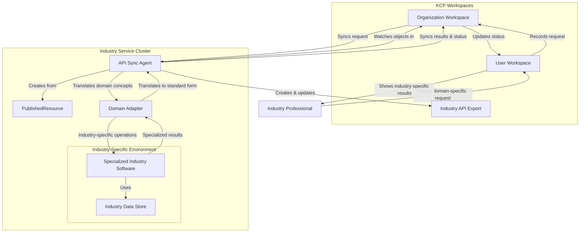

# API Sync Agent in Platform Mesh

## Platform Mesh Context

The Platform Mesh creates an environment where:
- Service providers can offer services of any kind
- Service consumers can discover, order capabilities, and control lifecycles
- Different providers can be interconnected via standardized interfaces
- Services transcend traditional IaaS/PaaS/SaaS boundaries

## KCP API Sync Agent Overview

The kcp API Sync Agent facilitates service provider integration by:
- Synchronizing resources between Kubernetes clusters and kcp workspaces
- Converting existing CRDs into APIResourceSchemas in kcp
- Enabling bidirectional synchronization of resource state
- Supporting resource projection and transformation

## Value for Managed Service Providers

The Sync Agent addresses key integration challenges:
- Allows MSPs to onboard existing services with minimal changes
- Eliminates need to rewrite components for kcp compatibility
- Provides standardized integration path for diverse service types
- Reduces technical barriers to joining the Platform Mesh

## Critical Analysis

### Pros

- **Lower Barrier to Entry**: Minimal code changes required for existing services
- **Familiar Patterns**: Leverages well-understood Kubernetes concepts
- **Standardized Integration**: Consistent approach for diverse service types
- **Flexible Transformation**: Resource projection and mutation capabilities
- **Collision Prevention**: Sophisticated naming and identification systems
- **Bidirectional State**: Handles both desired state and status synchronization

### Cons

- **Synchronization Overhead**: Potential performance impact versus native controllers
- **Additional Component**: Introduces another operational dependency
- **Configuration Complexity**: Requires careful setup of PublishedResources
- **Debugging Challenges**: Issues may span multiple systems
- **Resource Limitations**: Only specific resources are synchronized
- **Not Always Optimal**: May not suit highly dynamic or performance-critical workloads

## Controllers vs. Sync Mechanisms

- All controllers fundamentally "sync" desired state with actual state
- The Sync Agent uses a specialized form of reconciliation across boundaries
- Traditional controllers operate within a single cluster boundary
- Both patterns follow the same Kubernetes reconciliation principles
- Criticism of "sync" approach may be oversimplified

## Implementation Decision Factors

When deciding whether to use the Sync Agent:

- Existing investment in Kubernetes controllers
- Required integration timeline
- Performance requirements
- Available development resources
- Complexity of resource transformations
- Need for standardized onboarding path

## Use Cases

### 1. Legacy Service Integration

**Scenario**: An MSP has developed a database-as-a-service offering using custom Kubernetes operators that manage database clusters.

**How Sync Agent helps**: 
- Exposes existing database CRDs through kcp without rewriting the operators
- Maintains operator-specific logic on the service cluster where it's already proven and stable
- Allows customers to provision databases through a standardized API in the Platform Mesh

### 2. Specialized Workload Environments

**Scenario**: A machine learning service provider offers specialized GPU-accelerated model training and inference.

**How Sync Agent helps**:
- Keeps specialized GPU scheduling and hardware-specific logic on provider clusters
- Exposes standardized ML model training and inference APIs to Platform Mesh users
- Synchronizes job status and results back to user workspaces

### 3. Multi-Region Service Deployment

**Scenario**: A cloud provider needs to offer services in different geographic regions while maintaining a unified API.

**How Sync Agent helps**:
- Allows regional deployment of service clusters close to users
- Maintains a consistent API across all regions through the Platform Mesh
- Routes user requests to appropriate regional deployment based on configuration

```mermaid
flowchart TB
    subgraph "KCP Workspaces"
        OrgWS[Organization Workspace]
        APIExport[Unified API Export]
        UserWS[User Workspace]
    end
    
    subgraph "Region: Europe"
        SyncAgentEU[API Sync Agent EU]
        PubResEU[PublishedResource]
        ServiceEU[Service Implementation]
    end
    
    subgraph "Region: Asia"
        SyncAgentAS[API Sync Agent AS]
        PubResAS[PublishedResource]
        ServiceAS[Service Implementation]
    end
    
    subgraph "Region: US"
        SyncAgentUS[API Sync Agent US]
        PubResUS[PublishedResource]
        ServiceUS[Service Implementation]
    end
    
    User[Service Consumer] -->|Creates service request| UserWS
    UserWS -->|Records request| OrgWS
    
    SyncAgentEU & SyncAgentAS & SyncAgentUS -->|Contribute to| APIExport
    
    OrgWS -->|Routes based on location/config| SyncAgentEU
    OrgWS -->|Routes based on location/config| SyncAgentAS
    OrgWS -->|Routes based on location/config| SyncAgentUS
    
    SyncAgentEU -->|Creates from| PubResEU
    SyncAgentEU -->|Creates resource| ServiceEU
    ServiceEU -->|Status updates| SyncAgentEU
    SyncAgentEU -->|Syncs status| OrgWS
    
    SyncAgentAS -->|Creates from| PubResAS
    SyncAgentAS -->|Creates resource| ServiceAS
    ServiceAS -->|Status updates| SyncAgentAS
    SyncAgentAS -->|Syncs status| OrgWS
    
    SyncAgentUS -->|Creates from| PubResUS
    SyncAgentUS -->|Creates resource| ServiceUS
    ServiceUS -->|Status updates| SyncAgentUS
    SyncAgentUS -->|Syncs status| OrgWS
    
    OrgWS -->|Updates status| UserWS
    UserWS -->|Shows results| User
```

### 4. Certificate and Security Management

**Scenario**: An MSP specializes in certificate management and PKI infrastructure.

**How Sync Agent helps**:
- Exposes certificate management APIs (like cert-manager) through the Platform Mesh
- Synchronizes certificate requests to central PKI infrastructure
- Returns issued certificates and updates status for users

### 5. Hybrid Cloud Operations

**Scenario**: Enterprise customers need services that span both public cloud and on-premise environments.

**How Sync Agent helps**:
- Bridges on-premise services into the Platform Mesh ecosystem
- Allows consistent service consumption regardless of underlying infrastructure
- Enables data locality requirements to be met while maintaining unified service interfaces

### 6. Air-Gapped Environments

**Scenario**: Organizations in highly regulated industries need to consume services in environments with restricted connectivity.

**How Sync Agent helps**:
- Facilitates controlled synchronization across security boundaries
- Enables service delivery in restricted environments while maintaining security controls
- Supports manual synchronization patterns when needed

### 7. Regulated Service Delivery

**Scenario**: An MSP offers services that must comply with specific regulatory requirements regarding data residency.

**How Sync Agent helps**:
- Ensures actual service workloads remain in compliant regions/clusters
- Provides clear boundaries for audit and compliance verification
- Maintains proper data segregation while offering standardized APIs

### 8. Third-Party Integration

**Scenario**: An MSP wants to incorporate third-party components that cannot be modified internally.

**How Sync Agent helps**:
- Creates a standardized wrapper around third-party components
- Translates between Platform Mesh conventions and third-party APIs
- Provides consistent experience across owned and third-party components

### 9. Gradual Cloud-Native Transition

**Scenario**: An MSP is transitioning services to cloud-native architecture but needs to maintain existing infrastructure.

**How Sync Agent helps**:
- Offers a stepping stone toward fully cloud-native implementations
- Allows incremental modernization without disrupting service delivery
- Provides consistent API while backend implementations evolve

### 10. Industry-Specific Software Integration

**Scenario**: Providers of specialized industry software (manufacturing, healthcare, etc.) want to offer their solutions as services.

**How Sync Agent helps**:
- Enables domain-specific software to participate in the broader Platform Mesh
- Abstracts industry-specific complexity behind standardized interfaces
- Creates consistent consumption patterns for specialized software

## Conclusion

The API Sync Agent provides a pragmatic onboarding path for MSPs into the Platform Mesh ecosystem. While it introduces its own set of challenges and considerations, it enables incremental integration and creates standardized interfaces for diverse service types.

The Sync Agent represents one of multiple integration approaches available in the Platform Mesh. Its value is particularly evident for existing Kubernetes-based services that would otherwise require significant reworking to participate in the Platform Mesh ecosystem.

By providing a bridge between traditional Kubernetes services and the Platform Mesh, the API Sync Agent helps accelerate adoption and expands the ecosystem of available services while maintaining the benefits of standardized interfaces and consistent user experiences.