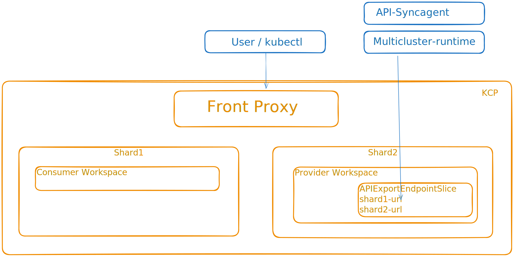

# kcp Production Quickstart Guide

kcp is a Kubernetes-like control plane that enables multi-tenant and multi-cluster scenarios. This guide shows how to set up a production-grade kcp environment with self-signed certificates as the base configuration.

All configurations use 2 shards (root and alpha), which is the recommended approach for multi-shard operations from the start.

## kcp Component Communication

To fully understand different deployment modes, you need to understand the communication patterns for kcp components. In general, shards do not communicate directly with each other; all communication is proxied via the front-proxy or cache server.

- **Front-proxy**: The main API endpoint for clients to access kcp. This is the main entry point for all external consumer clients.
   This is configured in both shards and front-proxy. In general, shards do not communicate directly with the front-proxy, with the exception of 2 cases:
    - When a new workspace is scheduled, the shard contacts the front-proxy to randomly pick a shard for the new workspace.
    - When an `APIExportEndpointSlice` or `CachedResourceEndpointSlice` URL is updated, the update happens via the front-proxy, as this is the only write operation where a shard might need to update an object on another shard. This is configured in deployments by setting `--externalHostname` or `spec.external.hostname` in front-proxy or shard configurations.

- **Shards**: Individual kcp shards that host workspaces. Shards can be exposed publicly or kept private.
   When deploying shards, you can configure the shard URL by setting `spec.shardBaseURL` in the shard spec, or by setting the `--shard-base-url` flag in the shard deployment.
   This URL will be used to expose the main shard API server endpoint. This is the endpoint that the front-proxy will use to communicate with the shard.

- **Virtual workspaces**: kcp supports the ability to run virtual workspaces outside shards. However, these guides will not cover this configuration. For now, the recommendation is to run virtual workspaces inside shards. Virtual workspaces have a separate flag to set the base URL: `--virtual-workspace-base-url`. It defaults to `spec.shardBaseURL`.

Once you have `kcp` deployed, you can check these values in the shard object in the root workspace:

```bash
kubectl get shards 
NAME    REGION   URL                                               EXTERNAL URL                                   AGE
alpha            https://alpha.comer.example.com:6443   https://api.comer.example.com:443   6d20h
root             https://root.comer.example.com:6443    https://api.comer.example.com:443   6d20h
```

In the shard spec, we can see the different URL options configured:

```bash
kubectl get shards -o yaml | grep spec -A 3
  spec:
    baseURL: https://alpha.comer.example.com:6443
    externalURL: https://api.comer.example.com:443
    virtualWorkspaceURL: https://alpha.comer.example.com:6443
--
  spec:
    baseURL: https://root.comer.example.com:6443
    externalURL: https://api.comer.example.com:443
    virtualWorkspaceURL: https://root.comer.example.com:6443
```

**Important**: The `virtualWorkspaceURL` is used to construct `VirtualWorkspace` endpoints. If you are running virtual workspace clients outside the cluster, you need to make sure this URL is accessible from outside.

Example:

```bash
KUBECONFIG=kcp-admin-kubeconfig-comer-internal.yaml kubectl get apiexportendpointslice tenancy.kcp.io -o yaml | grep endpoints -A 2
endpoints:
  - url: https://root.comer.example.com:6443/services/apiexport/root/tenancy.kcp.io
  - url: https://alpha.comer.example.com:6443/services/apiexport/alpha/tenancy.kcp.io
```

Any external client, like `api-syncagent`, will need to be able to access these URLs.

The basic defaulting logic is as follows:

```go
if shard.Spec.ExternalURL == "" {
    shard.Spec.ExternalURL = shard.Spec.BaseURL
}

if shard.Spec.VirtualWorkspaceURL == "" {
    shard.Spec.VirtualWorkspaceURL = shard.Spec.BaseURL
}
```

### High-level Diagram




## Base Configuration: Self-Signed Certificates

This guide covers the **kcp-dekker** deployment using self-signed certificates. This is:
- **Best for**: Development, testing, or closed internal environments  
- **Certificate approach**: All certificates are self-signed using an internal CA
- **Access pattern**: Only front-proxy is publicly accessible, shards are private
- **Network**: Simple single-cluster deployment

## Alternative Certificate Management

For production environments requiring different certificate strategies, see these variations:

- **[External Certificates (kcp-vespucci)](kcp-vespucci-external-certs.md)**: Uses Let's Encrypt for front-proxy with public shard access
- **[Dual Front-Proxy (kcp-comer)](kcp-comer-dual-frontproxy.md)**: CDN integration with edge re-encryption using CloudFlare

## Prerequisites

Before starting, you must install shared components that all kcp deployments depend on:

- etcd-druid operator for database storage  
- cert-manager for certificate management  
- kcp-operator for kcp lifecycle management  
- OIDC provider (dex) for authentication  
- DNS configuration  

Follow the [shard component installation guide](0-shared.md) for detailed instructions on each component.  

## Deployment Steps (kcp-dekker)

### 1. Create Namespace and etcd Certificates

```bash
kubectl create namespace kcp-dekker
kubectl apply -f kcp/assets/kcp-dekker/certificate-etcd.yaml
```

### 2. Deploy etcd Clusters

```bash
kubectl apply -f kcp/assets/kcp-dekker/etcd-druid-root.yaml
kubectl apply -f kcp/assets/kcp-dekker/etcd-druid-alpha.yaml
```

### 3. Configure KCP System Certificates

```bash
kubectl apply -f kcp/assets/kcp-dekker/certificate-kcp.yaml
```

### 4. Deploy KCP Components

```bash
kubectl apply -f kcp/assets/kcp-dekker/kcp-root-shard.yaml
kubectl apply -f kcp/assets/kcp-dekker/kcp-alpha-shard.yaml
kubectl apply -f kcp/assets/kcp-dekker/kcp-front-proxy.yaml
```

### 5. Configure DNS for Front-Proxy

1. **Get the LoadBalancer IP**:
   ```bash
   kubectl get svc -n kcp-dekker frontproxy-front-proxy
   ```

2. **Create DNS A record** pointing `api.dekker.example.com` to the LoadBalancer IP

3. **Verify certificate issuance**:
   ```bash
   kubectl get certificate -n kcp-dekker root-frontproxy-server -o yaml
   ```

### 6. Create and Test Admin Access

```bash
kubectl apply -f kcp/assets/kcp-dekker/kubeconfig-kcp-admin.yaml

kubectl get secret -n kcp-dekker kcp-admin-frontproxy \
  -o jsonpath='{.data.kubeconfig}' | base64 -d > kcp-admin-kubeconfig-dekker.yaml

KUBECONFIG=kcp-admin-kubeconfig-dekker.yaml kubectl get shards
```

Expected output:
```
NAME    REGION   URL                                                           EXTERNAL URL                                       AGE
alpha            https://alpha-shard-kcp.kcp-dekker.svc.cluster.local:6443   https://api.dekker.example.com:6443   14m
root             https://root-kcp.kcp-dekker.svc.cluster.local:6443          https://api.dekker.example.com:6443   14m
```

## Optional: OIDC Authentication

If you deployed the OIDC provider (Dex), you can configure OIDC authentication:

### Install kubectl OIDC Plugin

```bash
# macOS
brew install int128/kubelogin/kubelogin

# For other platforms, see: https://github.com/int128/kubelogin
```

### Configure OIDC Credentials

```bash
kubectl config set-credentials oidc \
  --exec-api-version=client.authentication.k8s.io/v1beta1 \
  --exec-command=kubectl \
  --exec-arg=oidc-login \
  --exec-arg=get-token \
  --exec-arg=--oidc-issuer-url="https://auth.example.com" \
  --exec-arg=--oidc-client-id="platform-mesh" \
  --exec-arg=--oidc-extra-scope="email" \
  --exec-arg=--oidc-client-secret=<YOUR_CLIENT_SECRET>

kubectl config set-context --current --user=oidc
```

## Certificate Trust Requirements

Since this setup uses self-signed certificates, external users will need to:
1. Add the internal CA certificate to their local trust store, OR
2. Configure kubectl to skip certificate validation (not recommended for production)

## Troubleshooting

**Certificate Trust Issues**: If clients cannot connect due to certificate validation errors, ensure the self-signed CA certificate is added to the client's trust store.

**DNS Resolution**: Verify that `api.dekker.example.com` resolves to the correct LoadBalancer IP.

**HTTP/2 Stream Error** `(92) HTTP/2 stream 1 was not closed cleanly: INTERNAL_ERROR (err 2)`: You are accessing a URL not served by the front-proxy. Verify the URL is correct.